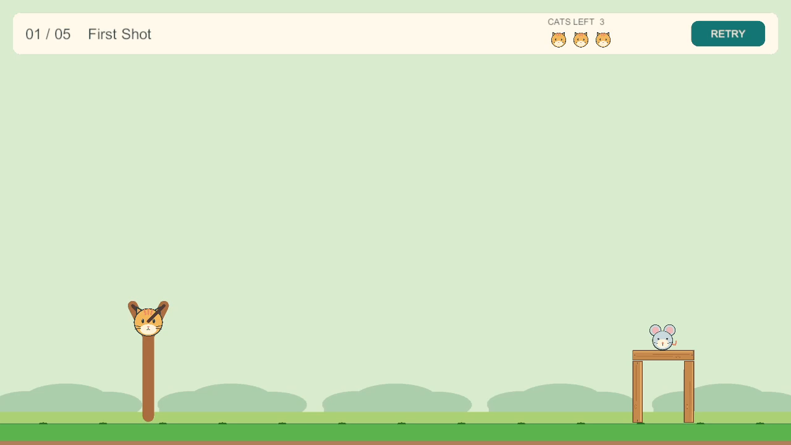
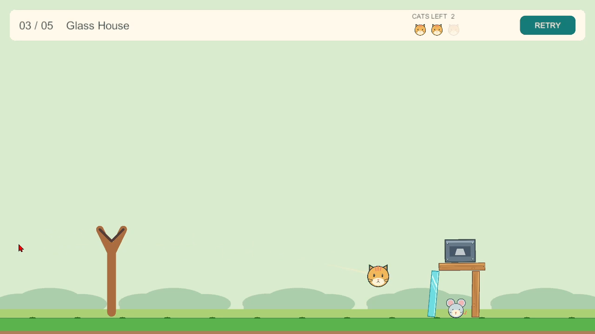
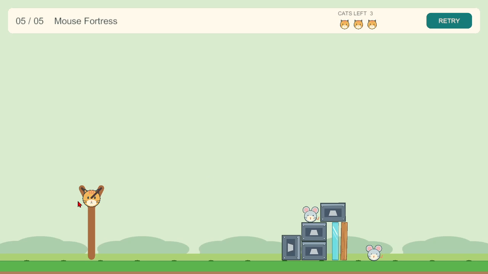

# CatapultCats

A compact 2D slingshot puzzle game about launching cats, toppling structures and outsmarting mice. Built as a Unity game-development portfolio project, with an emphasis on readable physics gameplay, data-driven levels and practical editor tooling.



**[Download Windows Demo](https://github.com/Alcasin/CatapultCats/releases/tag/v1.0.0)** · **[Watch the gameplay video](Docs/Media/CatapultCats_Gameplay.mp4)**

## Gameplay

- Drag a cat backward and release to launch a Rigidbody2D-based projectile; a short four-dot trajectory hints at the shot without revealing its destination.
- Physics-based destruction: break wood and glass, move heavy blocks and use falling structures to defeat the mice.
- Complete five manually authored levels with limited cats, Retry, Next Level and a final Play Again flow.
- Original procedurally generated 2D sprites, a backyard presentation, lightweight visual feedback and eight procedurally synthesized sound effects.
- A custom Unity Level Editor for placement, selection, rotation, duplication, validation, saving/loading and playtesting fixed-size pieces.

The campaign is **First Shot → Collapse → Glass House → Ricochet → Mouse Fortress**. Every level uses the same Gameplay scene and loads its layout from a `LevelDefinition` asset.

## Screenshots

| First Shot | Glass House | Mouse Fortress |
| --- | --- | --- |
|  |  |  |

## Technology and architecture

**Unity 6 (6000.3.8f1)**, 2D Built-In Render Pipeline, **C#**, Rigidbody2D/Collider2D, Input System **1.18.0**, Unity UI and Unity Test Framework/NUnit. No external service or sound-pack dependency is needed to play.

| Area | Responsibility |
| --- | --- |
| Launch | Pointer input, clamped drag, launch math and trajectory preview |
| Core / Physics | Shot counting, attempt states, impulse-based breakage, direct heavy crush and physics resolution |
| Levels | ScriptableObject layouts, prefab catalog, runtime loading and five-level flow |
| Presentation / Audio | Runtime HUD, camera framing, sprites/VFX and bounded event-driven SFX playback |
| Editor | Level authoring/validation and the Windows portfolio build command |

Runtime and Editor code use separate assembly definitions. Editor playtest overrides are guarded with `UNITY_EDITOR`; the standalone player starts from the first entry in the campaign. Retry reloads the current level, and finishing the last level returns to Level01. Audio observes gameplay events without controlling damage or attempt resolution.

## Open and play in Unity

1. Install Unity **6000.3.8f1** using Unity Hub. Include Windows Build Support for the standalone demo.
2. Add this repository's root folder as a project and let Unity import packages/assets and compile.
3. Open `Assets/_CatapultCats/Scenes/Gameplay.unity` and enter Play Mode for the regular campaign.

Click the cat, drag backward and release. Releasing inside the minimum launch distance cancels without spending a cat. Defeat all mice to win; running out of cats with mice remaining produces a retryable failure. Use the HUD's Retry and Next Level / Play Again buttons. There is no main menu, music, settings screen or persistent progression.

For authoring, open **CatapultCats > Level Editor**. Playtest Current Level deliberately uses the selected layout inside the Editor; a normal player build does not use that override. The saved five levels and presentation are the accepted baseline—do not rerun R3/R4/R5 setup generators or audio regeneration just to open or build the project.

## Windows portfolio demo

### Download

The manually tested **v1.0.0 Windows x64 portfolio demo is now published**.

1. Open the official **[Download Windows Demo — v1.0.0](https://github.com/Alcasin/CatapultCats/releases/tag/v1.0.0)** release page and download `CatapultCats-Windows-v1.0.0.zip`.
2. Extract the ZIP to a folder, keeping all included files together.
3. Launch `CatapultCats.exe`.

### Build from source

Outside Play Mode, choose **CatapultCats > Build Windows Portfolio Demo**. The command validates the saved Gameplay scene, campaign/catalog references and all eight audio clips, then builds a Windows x86-64 player at:

```text
Builds/Windows/CatapultCats.exe
```

The build uses Gameplay as its only scene and applies **1280×720 windowed** defaults. These are build-scoped PlayerSettings overrides; the Editor project's existing defaults are restored afterwards, including on build failure. Accepted gameplay, audio balance and scene content are not edited. LevelAuthoring is not included. The command does not automatically launch the executable.

Wait for the Console's `[CatapultCats R6] Build succeeded` message, then launch the executable and complete the final checks in [R6 release QA](Docs/R6_RELEASE_QA.md). Close the player with the window close button or Alt+F4. When sharing a demo, distribute the **entire Windows output folder**, not the executable alone: Unity's generated data and runtime files must stay beside it. `Builds/` is ignored by Git.

If a build fails, inspect the Console; an old executable left in the output directory is not proof that the new build succeeded.

## Testing and QA

The existing EditMode suite covers launch math, shot counting, impact/crush rules, level validation, sequence ordering and project foundations. Run it in **Window > General > Test Runner > EditMode > Run All**. The legacy foundation resolution test checks the Editor's original 1920×1080 defaults; the release build's temporary 1280×720 settings do not change that contract.

**All 59 EditMode tests passed.** The Windows x64 standalone demo has been manually tested, with all five levels and audio effects working, including the final user-authored Mouse Fortress layout. Automated tests complement rather than replace manual checks of physics, game feel, presentation and sound. [R6_RELEASE_QA.md](Docs/R6_RELEASE_QA.md) documents the release checklist; earlier milestone QA notes remain in `Docs/`.

## Project structure

```text
Assets/_CatapultCats/
  Art/                 Original sprite assets
  Audio/SFX/           Eight accepted WAV effects and import metadata
  Data/                LevelDefinitions, PieceCatalog and PlayableLevels
  Editor/              Level Editor, validators and portfolio build command
  Prefabs/             Fixed-size gameplay pieces and authored debris
  Scenes/Gameplay.unity
  Scripts/             Launch, core, physics, levels, presentation and audio
  Tests/EditMode/      Focused NUnit tests
Docs/                  Project direction and manual QA checklists
  Media/               Approved gameplay screenshots and video
Tools/                 Reproducible standard-library audio synthesis script
```
